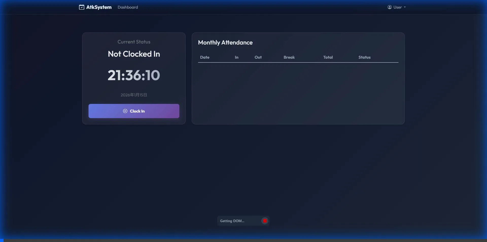

# AtkSystem - Modern Attendance Management System
 

**AtkSystem** は、最新のWeb技術を用いて構築された、直感的で美しい勤怠管理システムです。
ASP.NET Core (MVC) をベースに、堅牢なバックエンド設計と「Glassmorphism（グラスモーフィズム）」を取り入れたモダンなUIを融合させました。

主に **日々の勤怠打刻**、**休暇申請ワークフロー**、**管理者向け機能** を提供します。

---

## ✨ Key Features (主な機能)

### 1. 勤怠打刻 & ダッシュボード
ユーザーはワンクリックで出勤・退勤・休憩の打刻が可能です。
直近のステータスが視覚的にわかりやすく表示され、月次の勤務状況もリアルタイムで確認できます。



### 2. 休暇申請ワークフロー
有給休暇などの申請をシステム上で行えます。申請状況（承認待ち・承認済み・却下）はリストで管理されます。


### 3. 管理者向け機能 (User & Leave Management)
管理者権限を持つユーザーは、専用のダッシュボードから以下の操作が可能です。
*   **ユーザー管理**: 新規社員の登録、情報の編集、アカウントの有効/無効化
*   **休暇承認**: 部下からの休暇申請を承認または却下
*   **CSVエクスポート**: 全社員の勤怠データを給与計算用にCSV形式でダウンロード


---

## 🛠 Technology Stack (使用技術)

### Backend
*   **Database**: SQL Server (LocalDB for Dev)
*   **Platform**: .NET 8.0 (C# 12)
*   **Framework**: ASP.NET Core MVC
*   **ORM**: Entity Framework Core (Code First Approach)
*   **Auth**: Cookie Authentication with BCrypt Hashing

### Frontend
*   **Template Engine**: Razor Views
*   **Styling**: Bootstrap 5 + Custom CSS (Glassmorphism Design)
*   **Interaction**: Vanilla JavaScript (Minimal & Efficient)

### Architecture
保守性と拡張性を重視し、関心事の分離を徹底した **レイヤードアーキテクチャ** を採用しています。
*   **Web Layer**: コントローラー、ビュー、ViewModel
*   **Core Layer**: ドメインエンティティ、インターフェース (Repository/Service)、Enum
*   **Infra Layer**: DBコンテキスト、リポジトリ実装、外部サービス実装

---

## 🚀 Getting Started (実行方法)

### 前提条件
*   .NET 8.0 SDK
*   SQL Server (LocalDB または Express)

### セットアップ & 起動

1.  **リポジトリのクローン**
    ```bash
    git clone https://github.com/onotatu85/AtkSystem.git
    cd AtkSystem
    ```

2.  **データベースのセットアップ**
    初回起動時に自動的にマイグレーションが適用され、データベースと初期データが作成されます。
    (`appsettings.json` の接続文字列は環境に合わせて変更してください)

3.  **アプリケーションの起動**
    ```bash
    dotnet run --project AtkSystem.Web
    ```

4.  **ブラウザでアクセス**
    `http://localhost:5298` にアクセスし、以下の初期アカウントでログインします。

    *   **Admin**: `EMP001` / `admin123`
    *   **User**: `EMP002` / `user123`

---

## 👨‍💻 Author
*   **Tatsuhiro Onodera** - *Full Stack Development*

---
*This project was created as a portfolio piece to demonstrate full-stack development capabilities with .NET technologies.*
